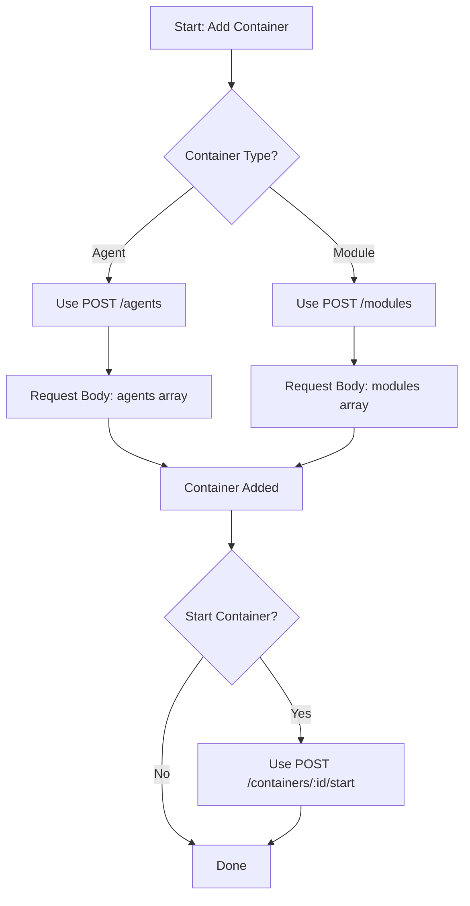
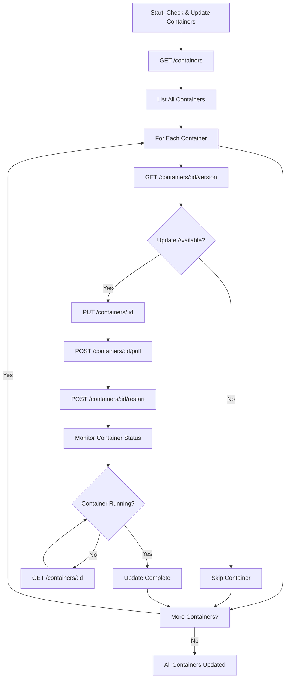

# Gluesync Conductor API Integration Flows

This document provides integration flow diagrams and examples for common container management operations using the Gluesync Conductor API.

## Container Addition Flow

The following diagram illustrates the decision flow for adding containers:



### Example: Adding an Agent Container

```javascript
// Example using fetch API
async function addAgentsContainer() {
  const response = await fetch('http://localhost:50002/agents', {
    method: 'POST',
    headers: {
      'Content-Type': 'application/json',
    },
    body: JSON.stringify({
      agents: [
        {
          imageName: 'gluesync-agent',
          type: 'target',
          nickname: 'my-target-agent',
          tag: 'latest',
          environment: {
            DEBUG: 'true'
          },
          ports: ['8080:8080'],
          volumes: ['/data:/app/data']
        }
      ]
    }),
  });
  
  return await response.json();
}
```

### Example: Adding a Module Container

```javascript
// Example using fetch API
async function addModuleContainer() {
  const response = await fetch('http://localhost:50002/modules', {
    method: 'POST',
    headers: {
      'Content-Type': 'application/json',
    },
    body: JSON.stringify({
      modules: [
        {
          imageName: 'gluesync-module',
          type: 'module',
          nickname: 'my-module',
          tag: 'latest',
          environment: {
            MODULE_CONFIG: 'value'
          },
          ports: ['9090:9090'],
          volumes: ['/module-data:/app/data']
        }
      ]
    }),
  });
  
  return await response.json();
}
```

## Container Update Flow

The following diagram illustrates the flow for checking and updating container versions:



### Example: Checking and Updating Container Versions

```javascript
// Example using fetch API
async function checkAndUpdateContainers() {
  // Step 1: Get all containers
  const containersResponse = await fetch('http://localhost:50002/containers');
  const containersData = await containersResponse.json();
  const containers = containersData.data;
  
  // Step 2: Process each container
  for (const container of containers) {
    // Step 3: Check for updates
    const versionResponse = await fetch(`http://localhost:50002/containers/${container.id}/version`);
    const versionData = await versionResponse.json();
    
    // Step 4: If update available, update the container
    if (versionData.data.version.updateAvailable) {
      console.log(`Update available for ${container.name}: ${versionData.data.version.current} -> ${versionData.data.version.latest}`);
      
      // Step 5: Update container configuration
      await fetch(`http://localhost:50002/containers/${container.id}`, {
        method: 'PUT',
        headers: {
          'Content-Type': 'application/json',
        },
        body: JSON.stringify({
          tag: versionData.data.version.latest
        }),
      });
      
      // Step 6: Pull the latest image
      await fetch(`http://localhost:50002/containers/${container.id}/pull`, {
        method: 'POST'
      });
      
      // Step 7: Restart the container
      await fetch(`http://localhost:50002/containers/${container.id}/restart`, {
        method: 'POST'
      });
      
      // Step 8: Monitor container status until it's running
      let containerRunning = false;
      while (!containerRunning) {
        const statusResponse = await fetch(`http://localhost:50002/containers/${container.id}`);
        const statusData = await statusResponse.json();
        
        if (statusData.data.running) {
          containerRunning = true;
          console.log(`Container ${container.name} successfully updated and running`);
        } else {
          // Wait a bit before checking again
          await new Promise(resolve => setTimeout(resolve, 1000));
        }
      }
    } else {
      console.log(`Container ${container.name} is already up to date (${versionData.data.version.current})`);
    }
  }
  
  console.log('All containers checked and updated');
}
```

## Best Practices

1. **Error Handling**: Always implement proper error handling for API calls
2. **Retries**: Implement retry logic for network failures
3. **Parallel Processing**: Consider using `Promise.all()` for processing multiple containers in parallel
4. **Polling Interval**: When monitoring container status, use an appropriate polling interval (e.g., 1-5 seconds)
5. **Timeout**: Implement a timeout for container status checks to avoid infinite loops
6. **Logging**: Log all API interactions for debugging purposes

## Complete Integration Example

For a complete integration example including error handling and best practices, see the [integration-example.js](./integration-example.js) file.
